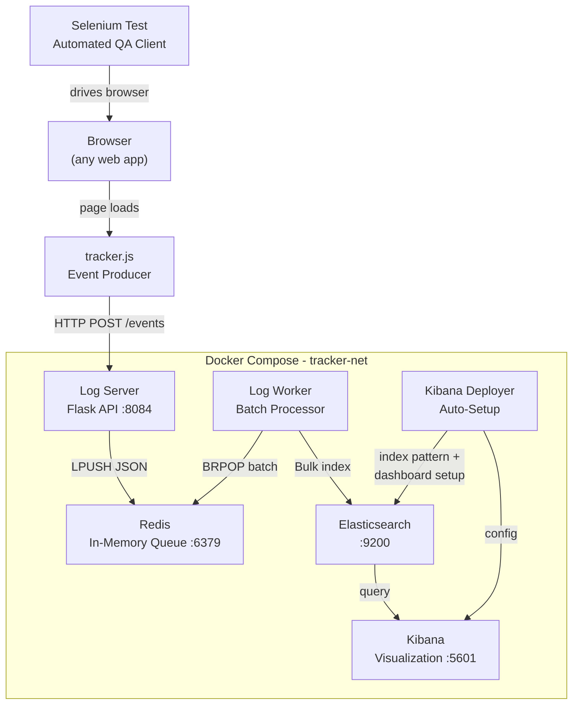

# Tracker Telemetry System

A real-time browser telemetry pipeline that captures user interactions, DOM queries, JavaScript errors, network requests, and performance metrics from web applications. Events are collected client-side by `tracker.js`, ingested through a Flask API, queued in Redis, batch-indexed into Elasticsearch, and visualized in Kibana with auto-provisioned dashboards.

**Key use case:** Monitor how users (and automated bots) interact with your web pages — detect broken selectors, JS crashes, suspicious click patterns, slow page loads, and connection issues in real time.

---

## Table of Contents

- [Architecture](#architecture)
- [How It Works](#how-it-works)
- [Prerequisites](#prerequisites)
- [Development Setup](#development-setup)
- [Production Deployment](#production-deployment)
- [tracker.js Integration Guide](#trackerjs-integration-guide)
- [Environment Variables](#environment-variables)
- [Services Reference](#services-reference)
- [Kibana Dashboard](#kibana-dashboard)
- [Elasticsearch Query Reference](#elasticsearch-query-reference)
- [Project Structure](#project-structure)
- [Troubleshooting](#troubleshooting)

---

## Architecture



---

## How It Works

| Step | Component | What It Does |
|------|-----------|--------------|
| 1 | **tracker.js** | Injected into any web page. Intercepts DOM queries, clicks, scroll, network calls, errors, and more. Sends each event as JSON via `sendBeacon` / `fetch` to the Log Server. |
| 2 | **Log Server** | Flask API (`POST /events`). Validates incoming JSON and pushes it into a Redis list. Returns `200` immediately — no blocking. |
| 3 | **Redis** | Acts as a fast in-memory queue (`LPUSH` / `BRPOP`). Decouples ingestion from indexing so the Log Server never waits on Elasticsearch. |
| 4 | **Log Worker** | Continuously reads batches from Redis (configurable `BATCH_SIZE` and `MAX_WAIT_TIME`). Normalizes timestamps and bulk-indexes documents into Elasticsearch. |
| 5 | **Elasticsearch** | Stores all events with typed mappings (keyword, integer, boolean, date). Provides full-text search and aggregations. |
| 6 | **Kibana Deployer** | Runs once at startup. Sets the `kibana_system` password, creates a Data View (`selenium-events*`), and imports an 11-panel Lens dashboard via the Saved Objects API. |
| 7 | **Kibana** | Serves the pre-built dashboard: event timeline, event type breakdown, broken selectors, JS crashes, performance overview, network requests, scroll depth, console errors, and connection issues. |

---

## Prerequisites

- **Docker** >= 20.10 and **Docker Compose** >= 2.0
- **4 GB RAM minimum** (Elasticsearch alone needs ~2 GB heap). 8 GB+ recommended for production.
- Ports `8084`, `9200`, `5601` available (configurable via `.env`)

---

## Development Setup

Development mode includes **all** services: the test web app (serves a sample page with `tracker.js`), the Selenium automated test client, and the full backend pipeline.

### 1. Configure environment

```bash
cp .env.example .env
```

Edit `.env` and set strong passwords:

```env
ELASTIC_PASSWORD=your_strong_password
KIBANA_SYSTEM_PASSWORD=another_strong_password
```

### 2. Start all services

```bash
docker compose -f docker-compose.dev.yml up -d --build
```

### 3. Verify

| Service | URL | Purpose |
|---------|-----|---------|
| Web App | `http://localhost:8081` | Sample page with tracker.js loaded — interact with it to generate events |
| Log Server | `http://localhost:8084/health` | Health check endpoint — should return `{"status": "healthy"}` |
| Kibana | `http://localhost:5601` | Dashboard UI — login with `elastic` / your `ELASTIC_PASSWORD` |

> Kibana takes 2-3 minutes on first boot. The Kibana Deployer automatically provisions the index pattern and dashboard.

### 4. Run the automated test (generates sample data)

The `selenium-test` container runs automatically on startup. It drives a headless Chrome browser through the web app, exercising:

- Text input, clicks, rapid bot-like clicks (triggers `timing-alert`)
- Broken CSS selectors, IDs, and XPaths (triggers `dom-query` / `xpath-query` with `found: false`)
- JavaScript errors, console errors, unhandled promise rejections
- Scroll, resize, right-click, and page navigation

After the test finishes, open Kibana to see the captured events on the dashboard.

### 5. Stop services

```bash
docker compose -f docker-compose.dev.yml down
```

> Add `-v` to also remove Elasticsearch data volumes.

---

## Production Deployment

In production, only the **backend pipeline** runs on the server. The `web-app` and `selenium-test` services are excluded. Developers integrate `tracker.js` directly into their own applications.

### Production architecture

```
Developer's Web App (with tracker.js)
        |
        |  HTTP POST /events
        v
+-----------------------------------------------+
|  Production Server (docker-compose.prod)       |
|                                                |
|  log-server (:8084)  --->  redis (:6379)       |
|                               |                |
|                           log-worker           |
|                               |                |
|                       elasticsearch (:9200)    |
|                               |                |
|  kibana-deployer --->    kibana (:5601)        |
+-----------------------------------------------+
```

### 1. Prepare the server

```bash
git clone <repo-url> && cd Tracker
cp .env.example .env
```

### 2. Configure `.env` for production

```env
# Strong passwords (required — do not use defaults)
ELASTIC_PASSWORD=<strong_password>
KIBANA_SYSTEM_PASSWORD=<another_strong_password>

# The public URL where browsers can reach the Log Server
# This is what tracker.js will POST events to
LOGSERVER_EXTERNAL_URL=http://<SERVER_IP>:8084

# Elasticsearch heap — set to 50% of server RAM, max 31 GB
ES_JAVA_OPTS=-Xms2g -Xmx4g

# Disable debug logging
DEBUG=false
```

> `LOGSERVER_EXTERNAL_URL` must be reachable from the end-user's browser (e.g., `http://10.20.0.5:8084` or `http://tracker.example.com:8084`).

### 3. Start services

```bash
docker compose -f docker-compose.prod.yml up -d --build
```

Services started:

| Service | Role | Port |
|---------|------|------|
| **redis** | Event queue | 6379 |
| **elasticsearch** | Log storage and indexing | 9200 |
| **kibana-deployer** | One-time dashboard setup | - |
| **kibana** | Visualization UI | 5601 |
| **log-server** | Event ingestion API | 8084 |
| **log-worker** | Redis to Elasticsearch batch processor | - |

### 4. Verify the deployment

```bash
# Check all containers are running
docker compose -f docker-compose.prod.yml ps

# Test the Log Server health endpoint
curl http://localhost:8084/health
# Expected: {"status": "healthy", "redis": "connected"}

# Test event ingestion
curl -X POST http://localhost:8084/events \
  -H "Content-Type: application/json" \
  -d '{"type": "test", "message": "hello from curl"}'
# Expected: {"status": "queued"}
```

Access Kibana at `http://<SERVER_IP>:5601` (user: `elastic`, password: your `ELASTIC_PASSWORD`).

### 5. Distribute tracker.js to developers

Give developers the file `web_app/app/static/tracker.js`. They add it to their HTML pages:

```html
<!-- Set the Log Server address BEFORE loading tracker.js -->
<script>
    window.ENV_LOGSERVER_URL = "http://<SERVER_IP>:8084";
</script>
<script src="tracker.js"></script>
```

That's it. No other configuration is needed. Events will flow automatically.

### Production notes

- **Data persistence:** Elasticsearch data is stored in the `es-data` Docker volume. Data survives container restarts and rebuilds.
- **HTTPS:** Set `XPACK_HTTP_SSL_ENABLED=true` in `.env` and configure TLS certificates for production use.
- **Scaling:** For higher throughput, increase `BATCH_SIZE` (e.g., 100-200) and decrease `MAX_WAIT_TIME` (e.g., 1.0s). You can also run multiple `log-worker` replicas.

---

## tracker.js Integration Guide

### What it tracks

`tracker.js` is a zero-dependency, self-contained IIFE (~700 lines) that automatically captures 17 event types:

| Category | Event Types | Key Fields |
|----------|-------------|------------|
| **DOM Queries** | `dom-query`, `xpath-query` | `selector`, `xpath`, `method`, `found` |
| **User Interaction** | `interaction` (click, input, focus, change, keydown) | `event`, `tag`, `id`, `class`, `xpath`, `page_x`, `page_y` |
| **Bot Detection** | `timing-alert` | `interval_ms`, `suspicious` — fires when clicks happen <80ms apart |
| **JS Errors** | `js-error`, `promise-rejection`, `console-error` | `message`, `source`, `lineno`, `colno`, `stack`, `level` |
| **Network** | `network-request` | `request_url`, `request_method`, `status_code`, `duration_ms`, `request_type` (fetch/xhr), `success` |
| **Performance** | `performance` | `dom_content_loaded_ms`, `load_complete_ms`, `first_contentful_paint_ms`, `resource_count`, `transfer_size_bytes` |
| **Navigation** | `page-load`, `navigation`, `page-unload` | `navigation_type`, `referrer`, `time_on_page_ms`, `final_scroll_depth_percent`, `event_count` |
| **Scroll** | `scroll-depth` | `current_depth_percent`, `max_depth_percent`, `page_height` |
| **UI Events** | `form-submit`, `clipboard`, `context-menu`, `resize`, `visibility` | form details, action, coordinates, dimensions |
| **Connection** | `connection` | `status` (online/offline), `effective_type`, `downlink` |

### Base payload (included in every event)

| Field | Description |
|-------|-------------|
| `session_id` | UUID generated per page load |
| `url` | Current page URL |
| `user_agent` | Browser user agent string |
| `is_webdriver` | `true` if browser is automated (Selenium, Puppeteer, etc.) |
| `language` | Browser language |
| `screen_resolution` | Screen width x height |
| `client_time` | ISO 8601 timestamp |

### Configuration

`tracker.js` reads these global variables (set them **before** loading the script):

| Variable | Required | Description |
|----------|----------|-------------|
| `window.ENV_LOGSERVER_URL` | Yes | Log Server URL (e.g., `http://10.20.0.5:8084`) |
| `window.ENV_LOGSERVER_INTERNAL_URL` | No | Override URL for WebDriver sessions (Docker internal network) |
| `window.ENV_DEBUG` | No | Set to `"true"` to log events to browser console |

### Design principles

- **Non-blocking:** Uses `sendBeacon` (primary) and `fetch` with `keepalive` (fallback). Never blocks the host page.
- **Fail-silent:** Every handler is wrapped in try/catch. The tracker never throws errors or breaks the host application.
- **Re-entrancy safe:** A guard prevents infinite loops from intercepted APIs (e.g., `fetch` interception triggering another tracked `fetch`).
- **Self-excluding:** Network interception skips requests to the tracker's own endpoint.

---

## Environment Variables

All variables are defined in `.env.example` with detailed comments. Key variables:

### Security

| Variable | Default | Description |
|----------|---------|-------------|
| `ELASTIC_PASSWORD` | `changeme` | Password for the `elastic` superuser. **Change in production.** |
| `KIBANA_SYSTEM_PASSWORD` | `changeme` | Password for the `kibana_system` service account. **Change in production.** |

### Elasticsearch

| Variable | Default | Description |
|----------|---------|-------------|
| `ES_JAVA_OPTS` | `-Xms1g -Xmx4g` | JVM heap. Set to 50% of server RAM, never exceed 31 GB. |
| `DISCOVERY_TYPE` | `single-node` | Use `single-node` for standalone. Change for multi-node clusters. |
| `XPACK_HTTP_SSL_ENABLED` | `false` | Set `true` for production HTTPS (requires certificate config). |
| `ELASTIC_INDEX` | `selenium-events` | Elasticsearch index name where all events are stored. |

### Log Worker

| Variable | Default | Description |
|----------|---------|-------------|
| `BATCH_SIZE` | `50` | Max events per Elasticsearch bulk request. Higher = better throughput, more latency. |
| `MAX_WAIT_TIME` | `2.0` | Max seconds to wait before flushing an incomplete batch. Lower = more real-time. |
| `REDIS_QUEUE_KEY` | `selenium_logs` | Redis list key used as the event queue. |

### Networking

| Variable | Default | Description |
|----------|---------|-------------|
| `LOGSERVER_EXTERNAL_URL` | `http://localhost:8084` | Public URL for tracker.js to POST events to. |
| `LOGSERVER_INTERNAL_URL` | `http://log-server:8084` | Docker-internal URL for WebDriver sessions. |
| `LOG_SERVER_PORT` | `8084` | Host port for the Log Server. |
| `KIBANA_PORT` | `5601` | Host port for Kibana. |
| `ELASTICSEARCH_PORT` | `9200` | Host port for Elasticsearch. |

---

## Services Reference

### Log Server (`log_server/`)

Flask API with a single endpoint:

| Endpoint | Method | Description |
|----------|--------|-------------|
| `POST /events` | POST | Accepts JSON (single object or array). Pushes to Redis queue. Returns `{"status": "queued"}`. |
| `GET /health` | GET | Returns Redis connection status. |

Supports CORS. Handles malformed JSON gracefully (wraps raw payload).

### Log Worker (`log_worker/`)

Long-running Python process:
- Connects to Redis and Elasticsearch with automatic retry on startup
- Creates the Elasticsearch index with explicit field mappings if it doesn't exist
- Reads events from Redis in batches using `BRPOP`
- Normalizes timestamps to `Z`-suffix ISO 8601 format (required by Elasticsearch strict date parser)
- Bulk-indexes documents into Elasticsearch

### Kibana Deployer (`kibana_deployer/`)

One-time initialization service:
1. Waits for Elasticsearch to be healthy
2. Sets the `kibana_system` user password
3. Waits for Kibana to be available
4. Creates a Data View (`selenium-events*`)
5. Imports a pre-built dashboard with 11 Lens visualizations via the Saved Objects `_import` API

**Dashboard panels:**
- Events Over Time (bar chart)
- Event Breakdown (donut)
- Most Interacted Elements (pie)
- Broken Selectors (table)
- Broken XPaths (table)
- JS Runtime Crashes (table)
- Performance Overview (table)
- Network Requests Over Time (bar chart)
- Scroll Depth Distribution (bar chart)
- Console Errors & Warnings (table)
- Connection Issues (table)

### Web App (`web_app/`) — Development only

Flask app serving a sample HTML page with `tracker.js` embedded. Provides two routes (`/` and `/dashboard`) to test page navigation tracking. Not included in the production compose file.

### Selenium Test (`selenium_test/`) — Development only

Headless Chrome automation that exercises all tracker.js event types: typing, clicking, broken queries, rapid clicks, JS errors, scrolling, resizing, and page navigation. Generates realistic test data for the Kibana dashboard. Not included in the production compose file.

---

## Kibana Dashboard

After deployment, access Kibana at `http://<host>:5601` and log in with `elastic` / your `ELASTIC_PASSWORD`.

The dashboard is auto-provisioned at: **Dashboards > Comprehensive Selenium Telemetry Dashboard**

To run ad-hoc queries, go to **Management > Dev Tools** and use the Elasticsearch queries below.

---

## Elasticsearch Query Reference

All queries target the `selenium-events` index. Run them in Kibana Dev Tools or via `curl`.

### General

**List all event types and their counts:**

```json
GET selenium-events/_search
{
  "size": 0,
  "aggs": {
    "event_types": {
      "terms": { "field": "type.keyword", "size": 50 }
    }
  }
}
```

**Event count per session (top 20):**

```json
GET selenium-events/_search
{
  "size": 0,
  "aggs": {
    "sessions": {
      "terms": { "field": "session_id.keyword", "size": 20, "order": { "_count": "desc" } }
    }
  }
}
```

**All events for a specific session (chronological):**

```json
GET selenium-events/_search
{
  "size": 200,
  "query": {
    "term": { "session_id.keyword": "<SESSION_UUID>" }
  },
  "sort": [{ "client_time": "asc" }]
}
```

**Event count over time (1-minute buckets):**

```json
GET selenium-events/_search
{
  "size": 0,
  "aggs": {
    "events_over_time": {
      "date_histogram": {
        "field": "client_time",
        "fixed_interval": "1m"
      },
      "aggs": {
        "by_type": {
          "terms": { "field": "type.keyword", "size": 10 }
        }
      }
    }
  }
}
```

### Bot Detection

**Suspicious rapid clicks (<80ms intervals):**

```json
GET selenium-events/_search
{
  "query": {
    "bool": {
      "must": [
        { "term": { "type.keyword": "timing-alert" } },
        { "term": { "suspicious": true } }
      ]
    }
  },
  "sort": [{ "client_time": "desc" }]
}
```

**WebDriver (automated) sessions:**

```json
GET selenium-events/_search
{
  "size": 0,
  "query": {
    "term": { "is_webdriver": true }
  },
  "aggs": {
    "automated_sessions": {
      "terms": { "field": "session_id.keyword", "size": 50 }
    }
  }
}
```

### Errors

**JavaScript runtime errors:**

```json
GET selenium-events/_search
{
  "query": {
    "term": { "type.keyword": "js-error" }
  },
  "_source": ["client_time", "message", "source", "lineno", "colno", "url"],
  "sort": [{ "client_time": "desc" }],
  "size": 50
}
```

**Unhandled promise rejections:**

```json
GET selenium-events/_search
{
  "query": {
    "term": { "type.keyword": "promise-rejection" }
  },
  "_source": ["client_time", "message", "stack", "url"],
  "sort": [{ "client_time": "desc" }]
}
```

**Console errors (error level only):**

```json
GET selenium-events/_search
{
  "query": {
    "bool": {
      "must": [
        { "term": { "type.keyword": "console-error" } }
      ],
      "filter": [
        { "term": { "level.keyword": "error" } }
      ]
    }
  },
  "_source": ["client_time", "level", "message", "url"],
  "sort": [{ "client_time": "desc" }]
}
```

### DOM Queries

**Failed selectors (element not found):**

```json
GET selenium-events/_search
{
  "query": {
    "bool": {
      "must": [
        { "terms": { "type.keyword": ["dom-query", "xpath-query"] } },
        { "term": { "found": false } }
      ]
    }
  },
  "_source": ["client_time", "type", "method", "selector", "xpath", "url"],
  "sort": [{ "client_time": "desc" }]
}
```

**Most queried CSS selectors:**

```json
GET selenium-events/_search
{
  "size": 0,
  "query": {
    "term": { "type.keyword": "dom-query" }
  },
  "aggs": {
    "top_selectors": {
      "terms": { "field": "selector.keyword", "size": 30 }
    }
  }
}
```

### Network

**Failed network requests:**

```json
GET selenium-events/_search
{
  "query": {
    "bool": {
      "must": [
        { "term": { "type.keyword": "network-request" } },
        { "term": { "success": false } }
      ]
    }
  },
  "_source": ["client_time", "request_url", "request_method", "status_code", "duration_ms", "request_type"],
  "sort": [{ "client_time": "desc" }]
}
```

**Slow requests (>2 seconds):**

```json
GET selenium-events/_search
{
  "query": {
    "bool": {
      "must": [
        { "term": { "type.keyword": "network-request" } },
        { "range": { "duration_ms": { "gt": 2000 } } }
      ]
    }
  },
  "_source": ["client_time", "request_url", "request_method", "status_code", "duration_ms"],
  "sort": [{ "duration_ms": "desc" }]
}
```

**Request distribution by URL (with avg duration and failure count):**

```json
GET selenium-events/_search
{
  "size": 0,
  "query": {
    "term": { "type.keyword": "network-request" }
  },
  "aggs": {
    "by_url": {
      "terms": { "field": "request_url.keyword", "size": 30 },
      "aggs": {
        "avg_duration": { "avg": { "field": "duration_ms" } },
        "failure_count": {
          "filter": { "term": { "success": false } }
        }
      }
    }
  }
}
```

### Performance

**Page load metrics by URL:**

```json
GET selenium-events/_search
{
  "query": {
    "term": { "type.keyword": "performance" }
  },
  "_source": [
    "client_time", "url",
    "dom_content_loaded_ms", "load_complete_ms", "dom_interactive_ms",
    "first_paint_ms", "first_contentful_paint_ms",
    "resource_count", "transfer_size_bytes"
  ],
  "sort": [{ "client_time": "desc" }],
  "size": 20
}
```

**Average page load times (global):**

```json
GET selenium-events/_search
{
  "size": 0,
  "query": {
    "term": { "type.keyword": "performance" }
  },
  "aggs": {
    "avg_dom_loaded": { "avg": { "field": "dom_content_loaded_ms" } },
    "avg_load_complete": { "avg": { "field": "load_complete_ms" } },
    "avg_fcp": { "avg": { "field": "first_contentful_paint_ms" } }
  }
}
```

### User Behavior

**Time on page and engagement stats:**

```json
GET selenium-events/_search
{
  "size": 0,
  "query": {
    "term": { "type.keyword": "page-unload" }
  },
  "aggs": {
    "time_on_page": {
      "stats": { "field": "time_on_page_ms" }
    },
    "avg_scroll_depth": {
      "avg": { "field": "final_scroll_depth_percent" }
    },
    "avg_event_count": {
      "avg": { "field": "event_count" }
    }
  }
}
```

**Click coordinates (for heatmap analysis):**

```json
GET selenium-events/_search
{
  "query": {
    "bool": {
      "must": [
        { "term": { "type.keyword": "interaction" } },
        { "term": { "event.keyword": "click" } }
      ]
    }
  },
  "_source": ["page_x", "page_y", "tag", "id", "xpath", "url", "client_time"],
  "size": 500,
  "sort": [{ "client_time": "desc" }]
}
```

**Form submissions:**

```json
GET selenium-events/_search
{
  "query": {
    "term": { "type.keyword": "form-submit" }
  },
  "_source": ["client_time", "form_id", "form_action", "form_method", "field_count", "url"],
  "sort": [{ "client_time": "desc" }]
}
```

**Clipboard activity (copy/cut/paste):**

```json
GET selenium-events/_search
{
  "query": {
    "term": { "type.keyword": "clipboard" }
  },
  "_source": ["client_time", "action", "target_tag", "target_id", "target_xpath", "url"],
  "sort": [{ "client_time": "desc" }]
}
```

**Referrer and navigation type analysis:**

```json
GET selenium-events/_search
{
  "size": 0,
  "query": {
    "term": { "type.keyword": "page-load" }
  },
  "aggs": {
    "referrers": {
      "terms": { "field": "referrer.keyword", "size": 20, "missing": "direct" }
    },
    "nav_types": {
      "terms": { "field": "navigation_type.keyword" }
    }
  }
}
```

### Infrastructure

**Connection drops (offline events):**

```json
GET selenium-events/_search
{
  "query": {
    "bool": {
      "must": [
        { "term": { "type.keyword": "connection" } },
        { "term": { "status.keyword": "offline" } }
      ]
    }
  },
  "_source": ["client_time", "session_id", "effective_type", "url"],
  "sort": [{ "client_time": "desc" }]
}
```

**Browser / user agent distribution:**

```json
GET selenium-events/_search
{
  "size": 0,
  "aggs": {
    "user_agents": {
      "terms": { "field": "user_agent.keyword", "size": 20 }
    }
  }
}
```

**Screen resolution distribution:**

```json
GET selenium-events/_search
{
  "size": 0,
  "aggs": {
    "resolutions": {
      "terms": { "field": "screen_resolution.keyword", "size": 20 }
    }
  }
}
```

---

## Project Structure

```
Tracker/
├── web_app/                  # Flask app serving sample page with tracker.js (dev only)
│   └── app/
│       ├── app.py            # Flask routes (/ and /dashboard)
│       ├── static/
│       │   └── tracker.js    # Client-side telemetry script
│       └── templates/
│           └── index.html    # Sample test page
├── log_server/               # Event ingestion API
│   └── app/
│       └── main.py           # Flask API: POST /events, GET /health
├── log_worker/               # Redis-to-Elasticsearch batch processor
│   └── app/
│       └── main.py           # Batch consumer with index setup and timestamp normalization
├── kibana_deployer/          # Automatic Kibana dashboard provisioning
│   └── app/
│       └── main.py           # Data View + 11-panel Lens dashboard setup
├── selenium_test/            # Automated test client (dev only)
│   └── app/
│       └── main.py           # Headless Chrome test exercising all event types
├── .env.example              # Environment variable template with documentation
├── docker-compose.dev.yml    # Full stack including web-app and selenium-test
├── docker-compose.prod.yml   # Backend only (no web-app, no selenium-test)
└── features.md               # Detailed tracker.js feature documentation
```

---

## Troubleshooting

### Kibana shows "No data" or dashboard is empty

1. Check that the Log Worker is running and indexing: `docker logs log_worker`
2. Verify documents exist: `curl -u elastic:<password> http://localhost:9200/selenium-events/_count`
3. In Kibana, adjust the time range picker (top-right) to cover when events were generated
4. If the index was just created, refresh the Data View: **Stack Management > Data Views > Selenium Events View > Refresh**

### Log Server returns 503

Redis is not reachable. Check: `docker logs redis` and `docker logs log_server`

### Elasticsearch fails to start

Usually a memory issue. Check `docker logs elasticsearch` for `OutOfMemoryError`. Reduce `ES_JAVA_OPTS` heap or increase host RAM.

### tracker.js events are not arriving

1. Open the browser console. If `ENV_LOGSERVER_URL` is not set, you'll see: `[Tracker] ENV_LOGSERVER_URL is not set. Using default: ...`
2. Check the Network tab for `POST /events` requests. Look for CORS errors or connection refused.
3. Ensure `LOGSERVER_EXTERNAL_URL` in `.env` matches what the browser can reach.

### Docker image versions

| Service | Image | Version |
|---------|-------|---------|
| Redis | `redis` | `8.6-alpine` |
| Elasticsearch | `docker.elastic.co/elasticsearch/elasticsearch` | `9.3.2` |
| Kibana | `docker.elastic.co/kibana/kibana` | `9.3.2` |

> Elasticsearch and Kibana **must always be the same version**.
