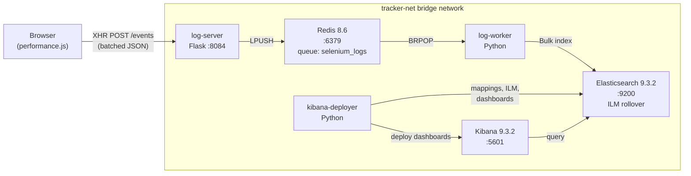
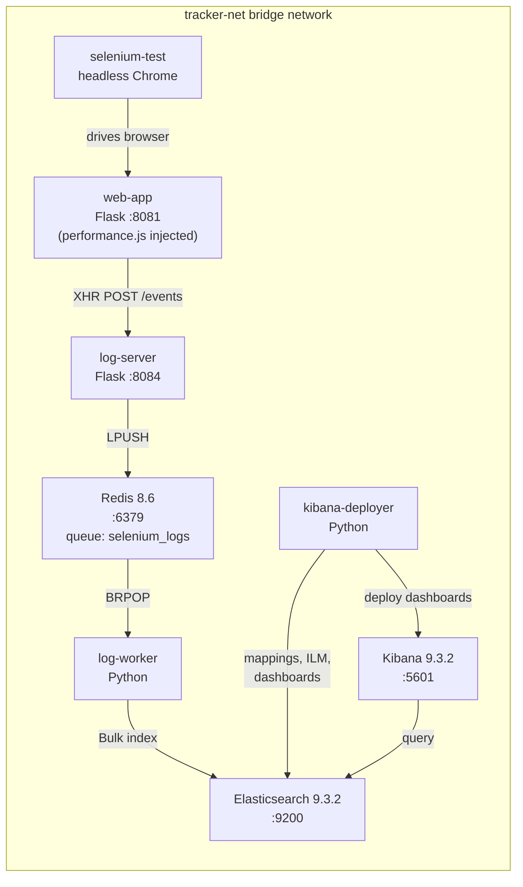

# Selenium Tracker

Browser telemetry and QA monitoring pipeline that captures events from web applications, routes them through a message queue, indexes them in Elasticsearch, and visualizes them in Kibana dashboards. 

## Architecture

### Production



### Dev / Test



## Services

| Service | Directory | Port | Description |
|---------|-----------|------|-------------|
| **web-app** | `web_app/` | 8081 | Flask demo app with `performance.js` tracker injected |
| **log-server** | `log_server/` | 8084 | Receives browser events and queues them to Redis |
| **log-worker** | `log_worker/` | — | Consumes Redis queue, bulk-indexes into Elasticsearch |
| **kibana-deployer** | `kibana_deployer/` | — | Configures ES mappings, ILM policy, data views, and deploys dashboards |
| **selenium-test** | `selenium_test/` | — | Headless Chrome test suite generating 25+ event categories |
| **redis** | *(image)* | 6379 | Event queue (redis:8.6-alpine) |
| **elasticsearch** | *(image)* | 9200 | Search and storage (9.3.2) |
| **kibana** | *(image)* | 5601 | Visualization UI (9.3.2) |

---

## Quick Start — Development (Test Mode)

Use this mode for local testing. Data is **ephemeral** — it is lost when containers are removed.

```bash
# 1. Clone and configure
cd Tracker
cp .env.example .env
```

Edit `.env` and change at minimum:

```dotenv
ELASTIC_PASSWORD=YourStrongPassword123
KIBANA_SYSTEM_PASSWORD=YourKibanaPass456
```

```bash
# 2. Build and start all services (including demo web-app and selenium tests)
docker compose -f docker-compose.dev.yml up -d --build

# 3. Watch logs to see the pipeline in action
docker compose -f docker-compose.dev.yml logs -f log-worker kibana-deployer
```

Wait until you see `All dashboards deployed successfully!` in the deployer logs and `Write alias 'selenium-events' is available` in the worker logs. This means the full pipeline is running.

```bash
# 4. Verify everything is healthy
docker compose -f docker-compose.dev.yml ps
```

All services should show `healthy` or `running`. Open:

| Service | URL |
|---------|-----|
| Web App | http://localhost:8081 |
| Kibana | http://localhost:5601 (login: `elastic` / your password) |
| Elasticsearch | http://localhost:9200 |
| Log Server Health | http://localhost:8084/health |

The demo web-app and selenium-test will automatically generate events. Browse to http://localhost:5601, log in, and open the **Selenium Monitoring Dashboard** to see live data.

```bash
# 5. Stop and clean up (removes all data)
docker compose -f docker-compose.dev.yml down -v
```

---

## Quick Start — Production

Production mode uses **persistent volumes** so Elasticsearch data survives container restarts. The ILM (Index Lifecycle Management) system automatically rolls over indices when they reach configured size/age limits and deletes old data after a retention period.

### Step 1: Configure Environment

```bash
cp .env.example .env
```

Edit `.env` with production values:

```dotenv
# REQUIRED: Change these from defaults
ELASTIC_PASSWORD=SecureProductionPassword!2026
KIBANA_SYSTEM_PASSWORD=KibanaSecurePass!2026

# Tune for your hardware (50% of system RAM, never more than 30GB)
# 8 GB RAM server:
ES_JAVA_OPTS=-Xms1g -Xmx4g
# 32 GB RAM server:
# ES_JAVA_OPTS=-Xms4g -Xmx16g

# High traffic: increase batch size for throughput
BATCH_SIZE=100
MAX_WAIT_TIME=2.0

# ILM: Adjust rollover and retention to your needs
ILM_MAX_SIZE=1gb          # Rollover when index hits this size
ILM_MAX_AGE=7d            # Rollover when index is this old
ILM_MAX_DOCS=5000000      # Rollover at this many documents
ILM_DELETE_AFTER=30d       # Auto-delete indices older than this
```

### Step 2: Start the Stack

```bash
# Build and start (detached)
docker compose -f docker-compose.prod.yml up -d --build

# Monitor startup (wait for deployer to finish)
docker compose -f docker-compose.prod.yml logs -f kibana-deployer log-worker
```

You will see these key log messages during startup:

```
DEPLOYER - INFO - [ES] ILM policy 'selenium-events-policy' created successfully
DEPLOYER - INFO - [ES] Field mappings configured successfully
DEPLOYER - INFO - [ES] Rollover index 'selenium-events-000001' created with write alias
DEPLOYER - INFO - [Kibana] All dashboards deployed successfully!
WORKER   - INFO - Write alias 'selenium-events' is available.
WORKER   - INFO - Starting log consumption from queue 'selenium_logs'
```

### Step 3: Verify the Pipeline

```bash
# Check cluster health
curl -s -u elastic:YourPassword http://localhost:9200/_cluster/health | python3 -m json.tool

# Check the ILM policy
curl -s -u elastic:YourPassword http://localhost:9200/_ilm/policy/selenium-events-policy | python3 -m json.tool

# Check the write alias
curl -s -u elastic:YourPassword http://localhost:9200/_alias/selenium-events | python3 -m json.tool

# Check current indices
curl -s -u elastic:YourPassword 'http://localhost:9200/_cat/indices/selenium-events-*?v&s=index'
```

Expected output from the last command:

```
health status index                   pri rep docs.count store.size
green  open   selenium-events-000001    1   0       1234      2.1mb
```

### Step 4: Integrate Your Web Applications

Add the tracker to any web application you want to monitor. Point it to the log server:

```html
<script>
  window.ENV_LOGSERVER_URL = "http://YOUR-SERVER-IP:8084";
</script>
<script src="performance.js"></script>
```

Events will start flowing through the pipeline immediately.

---

## Service Startup Order

Services start automatically in dependency order. You do not need to start them manually:

```
1. Redis + Elasticsearch        (infrastructure, start first)
2. Kibana Deployer              (waits for ES healthy, creates ILM policy + index + dashboards)
3. Kibana                       (waits for deployer healthcheck)
4. Log Server                   (waits for Redis healthy)
5. Log Worker                   (waits for ES + Redis + Kibana healthy, then waits for write alias)
6. Web App + Selenium Test      (waits for log-worker started)
```

---

## Configuration Reference

All configuration is managed through environment variables in `.env`. See [.env.example](.env.example) for the full list with descriptions.

### Core Settings

| Variable | Default | Description |
|----------|---------|-------------|
| `ELASTIC_PASSWORD` | `changeme` | Elasticsearch password — **change in production** |
| `KIBANA_SYSTEM_PASSWORD` | `changeme` | Kibana system password — **change in production** |
| `BATCH_SIZE` | `50` | Events per bulk index batch (increase for high traffic) |
| `MAX_WAIT_TIME` | `2.0` | Max seconds before flushing an incomplete batch |
| `ENV_TRACK_SUCCESS` | `false` | Set `true` to also log successful selector matches |
| `DEBUG` | `false` | Enable verbose logging across services |

### ILM (Index Lifecycle Management) Settings

These control how Elasticsearch handles large log volumes automatically:

| Variable | Default | Description |
|----------|---------|-------------|
| `ILM_MAX_SIZE` | `1gb` | Rollover index when it exceeds this size |
| `ILM_MAX_AGE` | `7d` | Rollover index when it is older than this |
| `ILM_MAX_DOCS` | `5000000` | Rollover index when it exceeds this many documents |
| `ILM_DELETE_AFTER` | `30d` | Automatically delete indices older than this |

**How ILM works:** Elasticsearch checks every 10 minutes if any rollover condition is met. When triggered, a new index is created (e.g., `selenium-events-000002`), the write alias moves to it, and the old index becomes read-only. After the retention period, old indices are deleted automatically.

```
selenium-events (write alias) ──> selenium-events-000003 (current, actively written)
                                  selenium-events-000002 (read-only, still searchable)
                                  selenium-events-000001 (read-only, will be deleted after ILM_DELETE_AFTER)
```

All indices remain searchable through Kibana's `selenium-events*` data view until they are deleted.

---

## How Index Rollover Works

When the system runs in production, indices accumulate over time:

```bash
# After a few weeks of operation, you will see multiple indices:
curl -s -u elastic:YourPassword 'http://localhost:9200/_cat/indices/selenium-events-*?v&s=index'

# Example output:
health status index                   pri rep docs.count store.size
green  open   selenium-events-000001    1   0    5000000      1.1gb
green  open   selenium-events-000002    1   0    3200000    720.5mb
green  open   selenium-events-000003    1   0     850000    195.2mb   <-- current write index
```

You can check which index is the current write target:

```bash
curl -s -u elastic:YourPassword http://localhost:9200/_alias/selenium-events | python3 -m json.tool
```

Check ILM status for all indices:

```bash
curl -s -u elastic:YourPassword 'http://localhost:9200/selenium-events-*/_ilm/explain' | python3 -m json.tool
```

---

## Backup and Restore — Complete Workflow

This section walks you through the full lifecycle: backing up rolled-over indices, moving them to another server, and reindexing them for analysis. This is the recommended approach for long-term log archival and forensic analysis.

### Overview

```
Production Server                          Backup / Analysis Server
┌─────────────────────┐                    ┌─────────────────────────┐
│ selenium-events-001 │──── snapshot ────> │ Restore from snapshot   │
│ selenium-events-002 │    (to shared      │ or                      │
│ selenium-events-003 │     storage or     │ Import from NDJSON file │
│ (active write)      │     file export)   │                         │
└─────────────────────┘                    │ Reindex into new index  │
                                           │ Analyze in Kibana       │
                                           └─────────────────────────┘
```

There are two approaches. Use **Method A (Elasticsearch Snapshots)** for large datasets or automated backups. Use **Method B (File Export/Import)** when you need to move data to a completely separate Elasticsearch cluster on another machine.

---

### Method A: Elasticsearch Snapshots (Recommended for Large Data)

#### A1. Register a Snapshot Repository

First, create a directory for snapshots on the host and mount it into the Elasticsearch container.

Add this volume to the `elasticsearch` service in your `docker-compose.prod.yml`:

```yaml
  elasticsearch:
    volumes:
      - es-data:/usr/share/elasticsearch/data
      - ./backups:/usr/share/elasticsearch/backups   # <-- add this line
```

Restart Elasticsearch, then register the repository:

```bash
# Create the backup directory on host
mkdir -p ./backups

# Restart ES to pick up the new volume
docker compose -f docker-compose.prod.yml up -d elasticsearch

# Register the snapshot repository
curl -X PUT -u elastic:YourPassword \
  'http://localhost:9200/_snapshot/selenium_backups' \
  -H 'Content-Type: application/json' \
  -d '{
    "type": "fs",
    "settings": {
      "location": "/usr/share/elasticsearch/backups"
    }
  }'
```

> **Note:** You also need to add `path.repo=/usr/share/elasticsearch/backups` to the Elasticsearch environment. Add this line to the `elasticsearch` service environment in your compose file:
> ```yaml
> - path.repo=/usr/share/elasticsearch/backups
> ```

#### A2. Take a Snapshot of Rolled-Over Indices

Snapshot specific old indices (not the currently active write index):

```bash
# Snapshot a single old index
curl -X PUT -u elastic:YourPassword \
  'http://localhost:9200/_snapshot/selenium_backups/snapshot_001?wait_for_completion=true' \
  -H 'Content-Type: application/json' \
  -d '{
    "indices": "selenium-events-000001",
    "ignore_unavailable": true,
    "include_global_state": false
  }'

# Snapshot multiple old indices at once
curl -X PUT -u elastic:YourPassword \
  'http://localhost:9200/_snapshot/selenium_backups/snapshot_week1?wait_for_completion=true' \
  -H 'Content-Type: application/json' \
  -d '{
    "indices": "selenium-events-000001,selenium-events-000002",
    "ignore_unavailable": true,
    "include_global_state": false
  }'
```

#### A3. Verify the Snapshot

```bash
# List all snapshots
curl -s -u elastic:YourPassword \
  'http://localhost:9200/_snapshot/selenium_backups/_all' | python3 -m json.tool

# Check a specific snapshot
curl -s -u elastic:YourPassword \
  'http://localhost:9200/_snapshot/selenium_backups/snapshot_001' | python3 -m json.tool
```

#### A4. Copy Snapshot Files to Another Server

The snapshot files are in `./backups/` on the host. Copy them to the backup/analysis server:

```bash
# Copy to another server via SCP
scp -r ./backups/ user@backup-server:/path/to/elasticsearch/backups/

# Or use rsync for incremental copies
rsync -avz ./backups/ user@backup-server:/path/to/elasticsearch/backups/
```

#### A5. Restore on the Analysis Server

On the analysis server, start a fresh Selenium Tracker instance (or a standalone Elasticsearch + Kibana):

```bash
# On the analysis server: start the stack
cd seleniumtracker/Workarea/Tracker
cp .env.example .env
# Edit .env with appropriate passwords
docker compose -f docker-compose.prod.yml up -d --build
```

Wait for the stack to be fully up, then register the snapshot repository (pointing to the copied files) and restore:

```bash
# Register the repo (same path where you copied the files)
curl -X PUT -u elastic:YourPassword \
  'http://localhost:9200/_snapshot/selenium_backups' \
  -H 'Content-Type: application/json' \
  -d '{
    "type": "fs",
    "settings": {
      "location": "/usr/share/elasticsearch/backups"
    }
  }'

# Restore a snapshot (restores the original index names)
curl -X POST -u elastic:YourPassword \
  'http://localhost:9200/_snapshot/selenium_backups/snapshot_001/_restore?wait_for_completion=true' \
  -H 'Content-Type: application/json' \
  -d '{
    "indices": "selenium-events-000001",
    "ignore_unavailable": true,
    "include_global_state": false
  }'
```

The restored index is immediately searchable in Kibana under the `selenium-events*` data view.

---

### Method B: File Export/Import (For Moving to a Different Server)

This method exports data to NDJSON files that can be copied anywhere and imported into any Elasticsearch instance.

#### B1. Export Data from a Rolled-Over Index

Use the Elasticsearch `_search` API with scrolling to export all documents:

```bash
# Export an entire index to NDJSON file
# This script handles pagination automatically

# Step 1: Start a scroll search
SCROLL_ID=$(curl -s -u elastic:YourPassword \
  'http://localhost:9200/selenium-events-000001/_search?scroll=5m' \
  -H 'Content-Type: application/json' \
  -d '{"size": 1000, "query": {"match_all": {}}}' \
  | python3 -c "
import sys, json
data = json.load(sys.stdin)
scroll_id = data['_scroll_id']
hits = data['hits']['hits']
for hit in hits:
    print(json.dumps({'index': {'_index': 'selenium-events-archive'}}))
    print(json.dumps(hit['_source']))
print(scroll_id, file=sys.stderr)
" 2>scroll_id.txt >export_000001.ndjson)

# Step 2: Continue scrolling until all documents are exported
while true; do
  SCROLL_ID=$(cat scroll_id.txt)
  RESULT=$(curl -s -u elastic:YourPassword \
    'http://localhost:9200/_search/scroll' \
    -H 'Content-Type: application/json' \
    -d "{\"scroll\": \"5m\", \"scroll_id\": \"$SCROLL_ID\"}" \
    | python3 -c "
import sys, json
data = json.load(sys.stdin)
scroll_id = data['_scroll_id']
hits = data['hits']['hits']
if not hits:
    sys.exit(1)
for hit in hits:
    print(json.dumps({'index': {'_index': 'selenium-events-archive'}}))
    print(json.dumps(hit['_source']))
print(scroll_id, file=sys.stderr)
" 2>scroll_id.txt >>export_000001.ndjson)
  if [ $? -ne 0 ]; then break; fi
done

rm scroll_id.txt
echo "Export complete: $(wc -l < export_000001.ndjson) lines"
```

Or use a simpler one-liner for smaller indices (under 10,000 docs):

```bash
# Quick export for small indices
curl -s -u elastic:YourPassword \
  'http://localhost:9200/selenium-events-000001/_search?size=10000' \
  -H 'Content-Type: application/json' \
  -d '{"query": {"match_all": {}}}' \
  | python3 -c "
import sys, json
data = json.load(sys.stdin)
for hit in data['hits']['hits']:
    print(json.dumps({'index': {'_index': 'selenium-events-archive'}}))
    print(json.dumps(hit['_source']))
" > export_000001.ndjson

echo "Exported $(grep -c '_index' export_000001.ndjson) documents"
```

#### B2. Copy the Export File to the Analysis Server

```bash
# Copy via SCP
scp export_000001.ndjson user@analysis-server:/path/to/imports/

# Or copy multiple files
scp export_*.ndjson user@analysis-server:/path/to/imports/
```

#### B3. Import on the Analysis Server

On the analysis server, start a Selenium Tracker stack and import the data:

```bash
# On the analysis server: start the stack
cd seleniumtracker/Workarea/Tracker
cp .env.example .env
# Edit .env
docker compose -f docker-compose.prod.yml up -d --build
# Wait for "All dashboards deployed successfully" in deployer logs
```

Import the NDJSON file using the Elasticsearch bulk API:

```bash
# Import the exported data
curl -s -u elastic:YourPassword \
  'http://localhost:9200/_bulk' \
  -H 'Content-Type: application/x-ndjson' \
  --data-binary @export_000001.ndjson

# For large files, split and import in chunks
split -l 10000 export_000001.ndjson chunk_
for f in chunk_*; do
  curl -s -u elastic:YourPassword \
    'http://localhost:9200/_bulk' \
    -H 'Content-Type: application/x-ndjson' \
    --data-binary @"$f"
  echo "Imported $f"
done
rm chunk_*
```

After import, the data appears in Kibana under the `selenium-events*` data view immediately.

---

### Reindexing Within the Same Elasticsearch Instance

If you want to reindex old data without moving it to another server (e.g., to apply new mappings or merge multiple indices into one):

```bash
# Reindex a single old index into a new one
curl -X POST -u elastic:YourPassword \
  'http://localhost:9200/_reindex' \
  -H 'Content-Type: application/json' \
  -d '{
    "source": { "index": "selenium-events-000001" },
    "dest":   { "index": "selenium-events-archive-000001" }
  }'

# Reindex ALL old indices into a single archive index
curl -X POST -u elastic:YourPassword \
  'http://localhost:9200/_reindex' \
  -H 'Content-Type: application/json' \
  -d '{
    "source": { "index": "selenium-events-000001,selenium-events-000002" },
    "dest":   { "index": "selenium-events-archive" }
  }'

# Reindex with a date filter (only events from a specific time range)
curl -X POST -u elastic:YourPassword \
  'http://localhost:9200/_reindex' \
  -H 'Content-Type: application/json' \
  -d '{
    "source": {
      "index": "selenium-events-000001",
      "query": {
        "range": {
          "@timestamp": {
            "gte": "2026-04-01T00:00:00Z",
            "lte": "2026-04-07T23:59:59Z"
          }
        }
      }
    },
    "dest": { "index": "selenium-events-week1-april" }
  }'

# Reindex only error events from an old index
curl -X POST -u elastic:YourPassword \
  'http://localhost:9200/_reindex' \
  -H 'Content-Type: application/json' \
  -d '{
    "source": {
      "index": "selenium-events-000001",
      "query": {
        "terms": {
          "severity": ["high", "critical"]
        }
      }
    },
    "dest": { "index": "selenium-events-critical-archive" }
  }'
```

After reindexing, if the new index name matches `selenium-events*`, it is automatically visible in Kibana. If you used a different name, create a data view in Kibana:

1. Go to **Stack Management** > **Data Views**
2. Click **Create data view**
3. Set pattern to your index name (e.g., `selenium-events-archive*`)
4. Set time field to `@timestamp`

---

### Full Example: Production Lifecycle

Here is a complete walkthrough from first deployment to backup and analysis on a separate server.

**Day 1 — Deploy in production:**

```bash
# On production server (e.g., 10.0.0.1)
cd seleniumtracker/Workarea/Tracker
cp .env.example .env
# Edit .env: set strong passwords, tune ES_JAVA_OPTS, set ILM values
docker compose -f docker-compose.prod.yml up -d --build

# Verify
curl -s -u elastic:YourPassword http://localhost:9200/_cat/indices/selenium-events-*?v
```

**Day 7 — First rollover happens automatically:**

```bash
# Check indices — you should see 000001 (read-only) and 000002 (active)
curl -s -u elastic:YourPassword 'http://localhost:9200/_cat/indices/selenium-events-*?v&s=index'
# Output:
# selenium-events-000001   1   0   5000000   1.1gb
# selenium-events-000002   1   0    120000   28mb
```

**Day 14 — Backup old index before it gets auto-deleted:**

```bash
# Export the first rolled-over index
curl -s -u elastic:YourPassword \
  'http://localhost:9200/selenium-events-000001/_search?scroll=5m&size=1000' \
  -H 'Content-Type: application/json' \
  -d '{"query": {"match_all": {}}}' \
  | python3 -c "
import sys, json
data = json.load(sys.stdin)
for hit in data['hits']['hits']:
    print(json.dumps({'index': {'_index': 'selenium-events-archive'}}))
    print(json.dumps(hit['_source']))
" > backup_000001.ndjson

# Copy to backup server
scp backup_000001.ndjson user@10.0.0.2:/backups/selenium/
```

**Day 30 — ILM auto-deletes selenium-events-000001 (you already have the backup).**

**Any time later — Analyze old logs on the analysis server:**

```bash
# On analysis server (e.g., 10.0.0.2)
cd seleniumtracker/Workarea/Tracker
cp .env.example .env
# Edit .env, set ILM_DELETE_AFTER=365d (keep data longer on analysis server)
docker compose -f docker-compose.prod.yml up -d --build

# Wait for stack to be ready, then import
curl -s -u elastic:YourPassword \
  'http://localhost:9200/_bulk' \
  -H 'Content-Type: application/x-ndjson' \
  --data-binary @/backups/selenium/backup_000001.ndjson

# Verify the data is there
curl -s -u elastic:YourPassword 'http://localhost:9200/_cat/indices/selenium-events*?v'

# Open Kibana at http://10.0.0.2:5601 and analyze the historical logs
```

---

## Useful Elasticsearch Commands

Quick reference for monitoring and managing the running system:

```bash
# Cluster health
curl -s -u elastic:YourPassword http://localhost:9200/_cluster/health?pretty

# List all indices with size and doc count
curl -s -u elastic:YourPassword 'http://localhost:9200/_cat/indices/selenium-events-*?v&s=index&h=index,health,status,docs.count,store.size'

# Check ILM status of all indices
curl -s -u elastic:YourPassword 'http://localhost:9200/selenium-events-*/_ilm/explain?only_errors=false' | python3 -m json.tool

# See which index the write alias points to
curl -s -u elastic:YourPassword 'http://localhost:9200/_alias/selenium-events' | python3 -m json.tool

# Check total document count across all indices
curl -s -u elastic:YourPassword 'http://localhost:9200/selenium-events-*/_count' | python3 -m json.tool

# Check disk usage
curl -s -u elastic:YourPassword 'http://localhost:9200/_cat/allocation?v'

# Force a rollover manually (without waiting for ILM)
curl -X POST -u elastic:YourPassword 'http://localhost:9200/selenium-events/_rollover'

# View the ILM policy
curl -s -u elastic:YourPassword 'http://localhost:9200/_ilm/policy/selenium-events-policy' | python3 -m json.tool

# Update ILM policy on a running system (e.g., change retention to 90 days)
curl -X PUT -u elastic:YourPassword \
  'http://localhost:9200/_ilm/policy/selenium-events-policy' \
  -H 'Content-Type: application/json' \
  -d '{
    "policy": {
      "phases": {
        "hot": {
          "actions": {
            "rollover": {
              "max_size": "1gb",
              "max_age": "7d",
              "max_docs": 5000000
            }
          }
        },
        "delete": {
          "min_age": "90d",
          "actions": { "delete": {} }
        }
      }
    }
  }'
```

---

## Stopping and Restarting

```bash
# Stop all services (data persists in production mode)
docker compose -f docker-compose.prod.yml down

# Restart (data is still there)
docker compose -f docker-compose.prod.yml up -d

# Full reset — remove all data and start fresh
docker compose -f docker-compose.prod.yml down -v
docker compose -f docker-compose.prod.yml up -d --build
```

---

## Event Categories

The `performance.js` tracker captures 25+ event types across these categories:

- **Automation Detection** — `navigator.webdriver`, Selenium globals, headless UA
- **Selector & XPath** — misses, errors, element inspections
- **Network** — XHR/fetch success, errors, slow requests (>5s)
- **JavaScript Errors** — uncaught errors, unhandled rejections, resource failures
- **Console** — `console.error()` and `console.warn()` interception
- **User Interactions** — clicks, programmatic clicks, rapid click bursts, disabled element clicks
- **Forms** — submissions, validation failures
- **Page Lifecycle** — load timing, idle detection, SPA navigation, connection status
- **DOM Mutations** — batch node additions/removals, attribute changes
- **Security** — CSP violations, WebSocket errors, blocking overlays
- **Framework Errors** — React, Angular, Vue, jQuery, Next.js, Nuxt specific errors

## Kibana Dashboard

The `kibana-deployer` automatically creates a comprehensive dashboard with 15 sections covering all event categories — from summary KPIs and timelines to per-category deep dives. No manual Kibana configuration needed.

## Privacy

All data is sanitized in the browser before transmission:

- 50+ sensitive field patterns redacted (passwords, tokens, API keys, SSNs, etc.)
- Email addresses masked (`us***@example.com`)
- Long hex/base64 tokens replaced with `[token]`
- Sensitive URL query parameters redacted
- Values truncated at configurable max length

## Integration

To add tracking to your own web application, include `performance.js` and set the endpoint:

```html
<script>
  window.ENV_LOGSERVER_URL = "http://your-log-server:8084";
</script>
<script src="performance.js"></script>
```

See [PROJECT_SUMMARY.md](PROJECT_SUMMARY.md) for the full list of `window.*` configuration globals.

## Further Reading

- [PROJECT_SUMMARY.md](PROJECT_SUMMARY.md) — Full technical documentation: architecture details, all event types, data flow, configuration reference
- [ANALYSIS_GUIDE.md](ANALYSIS_GUIDE.md) — Elasticsearch field reference, KQL query examples, and analysis workflows
