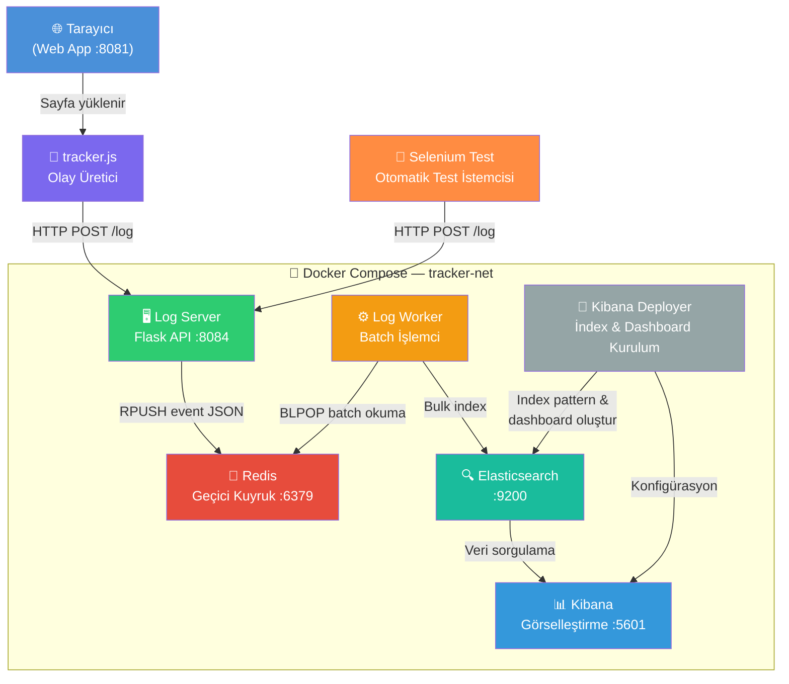

# 🎯 Tracker Telemetry System

**Tracker**, web uygulamalarındaki kullanıcı etkileşimlerini, DOM sorgularını ve frontend metriklerini gerçek zamanlı olarak izlemek için tasarlanmış kapsamlı bir telemetri sistemidir.

Veriler istemci tarafında `tracker.js` aracılığıyla üretilir; Flask tabanlı `LogServer` tarafından HTTP POST ile alınır; geçici olarak `Redis`'te saklanır; ardından `LogWorker` tarafından toplu hâlde `Elasticsearch`'e indekslenir. Son olarak kullanıcılar bu olayları `Kibana` üzerinden görselleştirebilir.

---

## 🏗️ Sistem Mimarisi ve Veri Akışı



### Veri Akışı Adım Adım

| Adım | Bileşen | Açıklama |
|------|---------|----------|
| 1 | **tracker.js** | Tarayıcıda DOM olaylarını (click, scroll, query…) yakalar |
| 2 | **Log Server** | HTTP POST ile gelen JSON logları doğrular ve Redis kuyruğuna ekler |
| 3 | **Redis** | `RPUSH/BLPOP` ile hızlı in-memory kuyruk görevi görür |
| 4 | **Log Worker** | Redis'ten `BATCH_SIZE` kadar olay okur, `MAX_WAIT_TIME` süresi dolunca Elasticsearch'e toplu yazar |
| 5 | **Elasticsearch** | Logları kalıcı olarak indeksler ve full-text arama sağlar |
| 6 | **Kibana Deployer** | İlk başlatmada index pattern ve dashboard'ları otomatik oluşturur |
| 7 | **Kibana** | İndekslenmiş verileri gerçek zamanlı grafikler ve dashboardlar ile görselleştirir |

---

## 🚀 Hızlı Başlangıç

### 1. Ortam değişkenlerini hazırlayın

```bash
cp .env.example .env
```

`.env` dosyasını açarak en az şu değerleri güncelleyin:

```env
ELASTIC_PASSWORD=güçlü_bir_parola
KIBANA_SYSTEM_PASSWORD=başka_bir_güçlü_parola
```

### 2. Servisleri başlatın

```bash
docker compose -f docker-compose.dev.yml up -d
```

### 3. Erişim

| Servis | URL |
|--------|-----|
| 🌐 Web App (tracker.js test alanı) | http://localhost:8081 |
| 📊 Kibana Dashboard | http://localhost:5601 |

> **Not:** Kibana ilk açılışta 2-3 dakika sürebilir. Kibana Deployer servisi index pattern ve dashboard'ları otomatik olarak kurar.

---

## ⚙️ Environment Değişkenleri

| Değişken | Varsayılan | Açıklama |
|----------|------------|----------|
| `ELASTIC_PASSWORD` | `changeme` | Elasticsearch `elastic` kullanıcısı şifresi |
| `KIBANA_SYSTEM_PASSWORD` | `changeme` | `kibana_system` kullanıcısı şifresi |
| `ES_JAVA_OPTS` | `-Xms1g -Xmx4g` | JVM heap boyutu (RAM'in %50'sini geçmeyin) |
| `BATCH_SIZE` | `50` | Log Worker'ın tek seferinde işlediği olay sayısı |
| `MAX_WAIT_TIME` | `2.0` | Batch dolmasa bile maksimum bekleme süresi (sn) |
| `ELASTIC_INDEX` | `selenium-events` | Logların yazıldığı Elasticsearch index adı |

Tüm değişkenler ve açıklamaları için `.env.example` dosyasına bakın.

---

## 🐳 Docker İmaj Versiyonları

| Servis | İmaj | Versiyon |
|--------|------|----------|
| Redis | `redis` | `8.6-alpine` |
| Elasticsearch | `docker.elastic.co/elasticsearch/elasticsearch` | `9.3.2` |
| Kibana | `docker.elastic.co/kibana/kibana` | `9.3.2` |

> Elasticsearch ve Kibana **her zaman aynı versiyon** olmalıdır.

---

## 🗂️ Proje Yapısı

```
Tracker/
├── web_app/           # Frontend + tracker.js test sayfası (Flask)
├── log_server/        # Log alım API'si (Flask)
├── log_worker/        # Redis→Elasticsearch batch işlemci
├── kibana_deployer/   # Otomatik Kibana kurulum scripti
├── selenium_test/     # Otomatik test istemcisi
├── .env.example       # Ortam değişkeni şablonu
└── docker-compose.dev.yml
```
