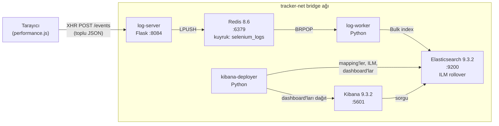
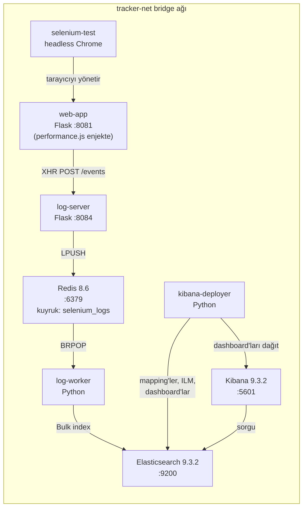

# Selenium Tracker

Web uygulamalarından olayları yakalayan, bir mesaj kuyruğu üzerinden yönlendiren, Elasticsearch'te indeksleyen ve Kibana dashboard'larında görselleştiren tarayıcı telemetrisi ve QA izleme pipeline'ı.

## Mimari

### Production



### Dev / Test



## Servisler

| Servis | Dizin | Port | Açıklama |
|--------|-------|------|----------|
| **web-app** | `web_app/` | 8081 | `performance.js` tracker enjekte edilmiş Flask demo uygulaması |
| **log-server** | `log_server/` | 8084 | Tarayıcı olaylarını alır ve Redis'e kuyruğa alır |
| **log-worker** | `log_worker/` | — | Redis kuyruğunu tüketir, Elasticsearch'e toplu indeksler |
| **kibana-deployer** | `kibana_deployer/` | — | ES mapping'lerini, ILM politikasını, data view'ları yapılandırır ve dashboard'ları dağıtır |
| **selenium-test** | `selenium_test/` | — | 25+ olay kategorisi üreten headless Chrome test paketi |
| **redis** | *(image)* | 6379 | Olay kuyruğu (redis:8.6-alpine) |
| **elasticsearch** | *(image)* | 9200 | Arama ve depolama (9.3.2) |
| **kibana** | *(image)* | 5601 | Görselleştirme arayüzü (9.3.2) |

---

## Hızlı Başlangıç — Geliştirme (Test Modu)

Bu modu yerel test için kullanın. Veri **geçicidir** — konteynerler kaldırıldığında kaybolur.

```bash
# 1. Klonla ve yapılandır
cd Tracker
cp .env.example .env
```

`.env` dosyasını düzenleyin ve en azından şunları değiştirin:

```dotenv
ELASTIC_PASSWORD=GucluSifreniz123
KIBANA_SYSTEM_PASSWORD=KibanaSifreniz456
```

```bash
# 2. Tüm servisleri oluştur ve başlat (demo web-app ve selenium testleri dahil)
docker compose -f docker-compose.dev.yml up -d --build

# 3. Pipeline'ın çalıştığını görmek için logları izleyin
docker compose -f docker-compose.dev.yml logs -f log-worker kibana-deployer
```

Deployer loglarında `All dashboards deployed successfully!` ve worker loglarında `Write alias 'selenium-events' is available` mesajlarını görene kadar bekleyin. Bu, tam pipeline'ın çalıştığı anlamına gelir.

```bash
# 4. Her şeyin sağlıklı olduğunu doğrulayın
docker compose -f docker-compose.dev.yml ps
```

Tüm servisler `healthy` veya `running` durumunda olmalı. Açın:

| Servis | URL |
|--------|-----|
| Web App | http://localhost:8081 |
| Kibana | http://localhost:5601 (giriş: `elastic` / şifreniz) |
| Elasticsearch | http://localhost:9200 |
| Log Server Sağlık | http://localhost:8084/health |

Demo web-app ve selenium-test otomatik olarak olay üretecek. http://localhost:5601 adresine gidin, giriş yapın ve canlı verileri görmek için **Selenium Monitoring Dashboard**'u açın.

```bash
# 5. Durdur ve temizle (tüm verileri siler)
docker compose -f docker-compose.dev.yml down -v
```

---

## Hızlı Başlangıç — Production

Production modu **kalıcı volume'lar** kullanır, böylece Elasticsearch verileri konteyner yeniden başlatmalarında korunur. ILM (Index Lifecycle Management) sistemi, indeksler yapılandırılmış boyut/yaş limitlerine ulaştığında otomatik olarak rollover yapar ve saklama süresinden sonra eski verileri siler.

### Adım 1: Ortamı Yapılandır

```bash
cp .env.example .env
```

`.env` dosyasını production değerleriyle düzenleyin:

```dotenv
# GEREKLİ: Varsayılanlardan değiştirin
ELASTIC_PASSWORD=GuvenliProductionSifresi!2026
KIBANA_SYSTEM_PASSWORD=KibanaGuvenliSifre!2026

# Donanımınıza göre ayarlayın (sistem RAM'inin %50'si, asla 30GB'dan fazla değil)
# 8 GB RAM sunucu:
ES_JAVA_OPTS=-Xms1g -Xmx4g
# 32 GB RAM sunucu:
# ES_JAVA_OPTS=-Xms4g -Xmx16g

# Yüksek trafik: throughput için batch boyutunu artırın
BATCH_SIZE=100
MAX_WAIT_TIME=2.0

# ILM: Rollover ve saklama süresini ihtiyaçlarınıza göre ayarlayın
ILM_MAX_SIZE=1gb          # İndeks bu boyuta ulaşınca rollover
ILM_MAX_AGE=7d            # İndeks bu yaşa ulaşınca rollover
ILM_MAX_DOCS=5000000      # Bu belge sayısında rollover
ILM_DELETE_AFTER=30d       # Bundan eski indeksleri otomatik sil
```

### Adım 2: Stack'i Başlat

```bash
# Oluştur ve başlat (detached)
docker compose -f docker-compose.prod.yml up -d --build

# Başlangıcı izle (deployer'ın bitmesini bekle)
docker compose -f docker-compose.prod.yml logs -f kibana-deployer log-worker
```

Başlangıç sırasında şu önemli log mesajlarını göreceksiniz:

```
DEPLOYER - INFO - [ES] ILM policy 'selenium-events-policy' created successfully
DEPLOYER - INFO - [ES] Field mappings configured successfully
DEPLOYER - INFO - [ES] Rollover index 'selenium-events-000001' created with write alias
DEPLOYER - INFO - [Kibana] All dashboards deployed successfully!
WORKER   - INFO - Write alias 'selenium-events' is available.
WORKER   - INFO - Starting log consumption from queue 'selenium_logs'
```

### Adım 3: Pipeline'ı Doğrula

```bash
# Cluster sağlığını kontrol et
curl -s -u elastic:SifrenizBuraya http://localhost:9200/_cluster/health | python3 -m json.tool

# ILM politikasını kontrol et
curl -s -u elastic:SifrenizBuraya http://localhost:9200/_ilm/policy/selenium-events-policy | python3 -m json.tool

# Write alias'ı kontrol et
curl -s -u elastic:SifrenizBuraya http://localhost:9200/_alias/selenium-events | python3 -m json.tool

# Mevcut indeksleri kontrol et
curl -s -u elastic:SifrenizBuraya 'http://localhost:9200/_cat/indices/selenium-events-*?v&s=index'
```

Son komuttan beklenen çıktı:

```
health status index                   pri rep docs.count store.size
green  open   selenium-events-000001    1   0       1234      2.1mb
```

### Adım 4: Web Uygulamalarınızı Entegre Edin

İzlemek istediğiniz herhangi bir web uygulamasına tracker'ı ekleyin. Log sunucusuna yönlendirin:

```html
<script>
  window.ENV_LOGSERVER_URL = "http://SUNUCU-IP-ADRESINIZ:8084";
</script>
<script src="performance.js"></script>
```

Olaylar hemen pipeline üzerinden akmaya başlayacak.

---

## Servis Başlangıç Sırası

Servisler otomatik olarak bağımlılık sırasına göre başlar. Manuel olarak başlatmanız gerekmez:

```
1. Redis + Elasticsearch        (altyapı, ilk başlar)
2. Kibana Deployer              (ES sağlıklı olana kadar bekler, ILM politikası + indeks + dashboard'lar oluşturur)
3. Kibana                       (deployer healthcheck'ini bekler)
4. Log Server                   (Redis sağlıklı olana kadar bekler)
5. Log Worker                   (ES + Redis + Kibana sağlıklı olana kadar bekler, sonra write alias'ı bekler)
6. Web App + Selenium Test      (log-worker başlamasını bekler)
```

---

## Yapılandırma Referansı

Tüm yapılandırma `.env` dosyasındaki ortam değişkenleri üzerinden yönetilir. Açıklamalı tam liste için [.env.example](.env.example) dosyasına bakın.

### Temel Ayarlar

| Değişken | Varsayılan | Açıklama |
|----------|------------|----------|
| `ELASTIC_PASSWORD` | `changeme` | Elasticsearch şifresi — **production'da değiştirin** |
| `KIBANA_SYSTEM_PASSWORD` | `changeme` | Kibana sistem şifresi — **production'da değiştirin** |
| `BATCH_SIZE` | `50` | Toplu indeks batch başına olay (yüksek trafik için artırın) |
| `MAX_WAIT_TIME` | `2.0` | Eksik batch'i boşaltmadan önce maksimum saniye |
| `ENV_TRACK_SUCCESS` | `false` | Başarılı selector eşleşmelerini de loglamak için `true` yapın |
| `DEBUG` | `false` | Servisler genelinde ayrıntılı loglama etkinleştir |

### ILM (Index Lifecycle Management) Ayarları

Elasticsearch'ün büyük log hacimlerini otomatik olarak nasıl yönettiğini kontrol eder:

| Değişken | Varsayılan | Açıklama |
|----------|------------|----------|
| `ILM_MAX_SIZE` | `1gb` | Bu boyutu aştığında indeksi rollover yap |
| `ILM_MAX_AGE` | `7d` | Bu yaştan eski olduğunda indeksi rollover yap |
| `ILM_MAX_DOCS` | `5000000` | Bu belge sayısını aştığında indeksi rollover yap |
| `ILM_DELETE_AFTER` | `30d` | Bundan eski indeksleri otomatik sil |

**ILM nasıl çalışır:** Elasticsearch her 10 dakikada bir herhangi bir rollover koşulunun karşılanıp karşılanmadığını kontrol eder. Tetiklendiğinde, yeni bir indeks oluşturulur (örn. `selenium-events-000002`), write alias ona taşınır ve eski indeks salt okunur olur. Saklama süresinden sonra, eski indeksler otomatik olarak silinir.

```
selenium-events (write alias) ──> selenium-events-000003 (mevcut, aktif yazım)
                                  selenium-events-000002 (salt okunur, hala aranabilir)
                                  selenium-events-000001 (salt okunur, ILM_DELETE_AFTER sonra silinecek)
```

Tüm indeksler silinene kadar Kibana'nın `selenium-events*` data view'ı üzerinden aranabilir kalır.

---

## İndeks Rollover Nasıl Çalışır

Sistem production'da çalışırken, indeksler zamanla birikir:

```bash
# Birkaç haftalık işlemden sonra, birden fazla indeks göreceksiniz:
curl -s -u elastic:SifrenizBuraya 'http://localhost:9200/_cat/indices/selenium-events-*?v&s=index'

# Örnek çıktı:
health status index                   pri rep docs.count store.size
green  open   selenium-events-000001    1   0    5000000      1.1gb
green  open   selenium-events-000002    1   0    3200000    720.5mb
green  open   selenium-events-000003    1   0     850000    195.2mb   <-- mevcut write indeks
```

Hangi indeksin mevcut write hedefi olduğunu kontrol edebilirsiniz:

```bash
curl -s -u elastic:SifrenizBuraya http://localhost:9200/_alias/selenium-events | python3 -m json.tool
```

Tüm indeksler için ILM durumunu kontrol edin:

```bash
curl -s -u elastic:SifrenizBuraya 'http://localhost:9200/selenium-events-*/_ilm/explain' | python3 -m json.tool
```

---

## Yedekleme ve Geri Yükleme — Tam İş Akışı

Bu bölüm tam yaşam döngüsünü açıklar: rollover yapılmış indekslerin yedeklenmesi, başka bir sunucuya taşınması ve analiz için yeniden indekslenmesi. Bu, uzun vadeli log arşivleme ve adli analiz için önerilen yaklaşımdır.

### Genel Bakış

```
Production Sunucu                         Yedek / Analiz Sunucusu
┌─────────────────────┐                    ┌─────────────────────────┐
│ selenium-events-001 │──── snapshot ────> │ Snapshot'tan geri yükle │
│ selenium-events-002 │    (paylaşımlı     │ veya                    │
│ selenium-events-003 │     depolamaya     │ NDJSON dosyasından al   │
│ (aktif write)       │     veya dosya     │                         │
└─────────────────────┘     dışa aktarım)  │ Yeni indekse reindex    │
                                           │ Kibana'da analiz et     │
                                           └─────────────────────────┘
```

İki yaklaşım vardır. Büyük veri setleri veya otomatik yedeklemeler için **Yöntem A (Elasticsearch Snapshot'ları)** kullanın. Verileri tamamen ayrı bir makinedeki farklı bir Elasticsearch cluster'ına taşımanız gerektiğinde **Yöntem B (Dosya Dışa/İçe Aktarımı)** kullanın.

---

### Yöntem A: Elasticsearch Snapshot'ları (Büyük Veri için Önerilir)

#### A1. Snapshot Repository Kaydet

Önce, host'ta snapshot'lar için bir dizin oluşturun ve Elasticsearch konteynerine bağlayın.

`docker-compose.prod.yml` dosyanızdaki `elasticsearch` servisine bu volume'u ekleyin:

```yaml
  elasticsearch:
    volumes:
      - es-data:/usr/share/elasticsearch/data
      - ./backups:/usr/share/elasticsearch/backups   # <-- bu satırı ekleyin
```

Elasticsearch'ü yeniden başlatın, ardından repository'yi kaydedin:

```bash
# Host'ta yedek dizini oluşturun
mkdir -p ./backups

# Yeni volume'u almak için ES'i yeniden başlatın
docker compose -f docker-compose.prod.yml up -d elasticsearch

# Snapshot repository'sini kaydedin
curl -X PUT -u elastic:SifrenizBuraya \
  'http://localhost:9200/_snapshot/selenium_backups' \
  -H 'Content-Type: application/json' \
  -d '{
    "type": "fs",
    "settings": {
      "location": "/usr/share/elasticsearch/backups"
    }
  }'
```

> **Not:** Ayrıca Elasticsearch ortamına `path.repo=/usr/share/elasticsearch/backups` eklemeniz gerekir. Compose dosyanızdaki `elasticsearch` servis ortamına bu satırı ekleyin:
> ```yaml
> - path.repo=/usr/share/elasticsearch/backups
> ```

#### A2. Rollover Yapılmış İndekslerin Snapshot'ını Alın

Belirli eski indekslerin snapshot'ını alın (şu anda aktif yazılan indeks değil):

```bash
# Tek bir eski indeksin snapshot'ını al
curl -X PUT -u elastic:SifrenizBuraya \
  'http://localhost:9200/_snapshot/selenium_backups/snapshot_001?wait_for_completion=true' \
  -H 'Content-Type: application/json' \
  -d '{
    "indices": "selenium-events-000001",
    "ignore_unavailable": true,
    "include_global_state": false
  }'

# Birden fazla eski indeksin snapshot'ını bir kerede al
curl -X PUT -u elastic:SifrenizBuraya \
  'http://localhost:9200/_snapshot/selenium_backups/snapshot_hafta1?wait_for_completion=true' \
  -H 'Content-Type: application/json' \
  -d '{
    "indices": "selenium-events-000001,selenium-events-000002",
    "ignore_unavailable": true,
    "include_global_state": false
  }'
```

#### A3. Snapshot'ı Doğrulayın

```bash
# Tüm snapshot'ları listele
curl -s -u elastic:SifrenizBuraya \
  'http://localhost:9200/_snapshot/selenium_backups/_all' | python3 -m json.tool

# Belirli bir snapshot'ı kontrol et
curl -s -u elastic:SifrenizBuraya \
  'http://localhost:9200/_snapshot/selenium_backups/snapshot_001' | python3 -m json.tool
```

#### A4. Snapshot Dosyalarını Başka Bir Sunucuya Kopyalayın

Snapshot dosyaları host'ta `./backups/` dizinindedir. Yedek/analiz sunucusuna kopyalayın:

```bash
# SCP ile başka sunucuya kopyala
scp -r ./backups/ kullanici@yedek-sunucu:/yol/elasticsearch/backups/

# Veya artımlı kopyalar için rsync kullanın
rsync -avz ./backups/ kullanici@yedek-sunucu:/yol/elasticsearch/backups/
```

#### A5. Analiz Sunucusunda Geri Yükleyin

Analiz sunucusunda, yeni bir Selenium Tracker örneği başlatın (veya bağımsız Elasticsearch + Kibana):

```bash
# Analiz sunucusunda: stack'i başlat
cd seleniumtracker/Workarea/Tracker
cp .env.example .env
# .env dosyasını uygun şifrelerle düzenleyin
docker compose -f docker-compose.prod.yml up -d --build
```

Stack tamamen ayağa kalkana kadar bekleyin, ardından snapshot repository'sini kaydedin (kopyalanan dosyalara işaret ederek) ve geri yükleyin:

```bash
# Repository'yi kaydet (dosyaları kopyaladığınız yol)
curl -X PUT -u elastic:SifrenizBuraya \
  'http://localhost:9200/_snapshot/selenium_backups' \
  -H 'Content-Type: application/json' \
  -d '{
    "type": "fs",
    "settings": {
      "location": "/usr/share/elasticsearch/backups"
    }
  }'

# Snapshot'ı geri yükle (orijinal indeks adlarını geri yükler)
curl -X POST -u elastic:SifrenizBuraya \
  'http://localhost:9200/_snapshot/selenium_backups/snapshot_001/_restore?wait_for_completion=true' \
  -H 'Content-Type: application/json' \
  -d '{
    "indices": "selenium-events-000001",
    "ignore_unavailable": true,
    "include_global_state": false
  }'
```

Geri yüklenen indeks, `selenium-events*` data view'ı altında Kibana'da hemen aranabilir.

---

### Yöntem B: Dosya Dışa/İçe Aktarımı (Farklı Bir Sunucuya Taşımak İçin)

Bu yöntem, verileri herhangi bir yere kopyalanabilen ve herhangi bir Elasticsearch örneğine aktarılabilen NDJSON dosyalarına dışa aktarır.

#### B1. Rollover Yapılmış İndeksten Veri Dışa Aktar

Tüm belgeleri dışa aktarmak için scroll ile Elasticsearch `_search` API'sini kullanın:

```bash
# Bir indeksin tamamını NDJSON dosyasına dışa aktar
# Bu script sayfalamayı otomatik olarak yönetir

# Adım 1: Scroll araması başlat
SCROLL_ID=$(curl -s -u elastic:SifrenizBuraya \
  'http://localhost:9200/selenium-events-000001/_search?scroll=5m' \
  -H 'Content-Type: application/json' \
  -d '{"size": 1000, "query": {"match_all": {}}}' \
  | python3 -c "
import sys, json
data = json.load(sys.stdin)
scroll_id = data['_scroll_id']
hits = data['hits']['hits']
for hit in hits:
    print(json.dumps({'index': {'_index': 'selenium-events-archive'}}))
    print(json.dumps(hit['_source']))
print(scroll_id, file=sys.stderr)
" 2>scroll_id.txt >export_000001.ndjson)

# Adım 2: Tüm belgeler dışa aktarılana kadar scroll'a devam et
while true; do
  SCROLL_ID=$(cat scroll_id.txt)
  RESULT=$(curl -s -u elastic:SifrenizBuraya \
    'http://localhost:9200/_search/scroll' \
    -H 'Content-Type: application/json' \
    -d "{\"scroll\": \"5m\", \"scroll_id\": \"$SCROLL_ID\"}" \
    | python3 -c "
import sys, json
data = json.load(sys.stdin)
scroll_id = data['_scroll_id']
hits = data['hits']['hits']
if not hits:
    sys.exit(1)
for hit in hits:
    print(json.dumps({'index': {'_index': 'selenium-events-archive'}}))
    print(json.dumps(hit['_source']))
print(scroll_id, file=sys.stderr)
" 2>scroll_id.txt >>export_000001.ndjson)
  if [ $? -ne 0 ]; then break; fi
done

rm scroll_id.txt
echo "Dışa aktarım tamamlandı: $(wc -l < export_000001.ndjson) satır"
```

Veya küçük indeksler için daha basit tek satırlık (10.000 belgeden az):

```bash
# Küçük indeksler için hızlı dışa aktarım
curl -s -u elastic:SifrenizBuraya \
  'http://localhost:9200/selenium-events-000001/_search?size=10000' \
  -H 'Content-Type: application/json' \
  -d '{"query": {"match_all": {}}}' \
  | python3 -c "
import sys, json
data = json.load(sys.stdin)
for hit in data['hits']['hits']:
    print(json.dumps({'index': {'_index': 'selenium-events-archive'}}))
    print(json.dumps(hit['_source']))
" > export_000001.ndjson

echo "$(grep -c '_index' export_000001.ndjson) belge dışa aktarıldı"
```

#### B2. Dışa Aktarım Dosyasını Analiz Sunucusuna Kopyalayın

```bash
# SCP ile kopyala
scp export_000001.ndjson kullanici@analiz-sunucu:/yol/imports/

# Veya birden fazla dosya kopyala
scp export_*.ndjson kullanici@analiz-sunucu:/yol/imports/
```

#### B3. Analiz Sunucusunda İçe Aktar

Analiz sunucusunda, bir Selenium Tracker stack'i başlatın ve verileri içe aktarın:

```bash
# Analiz sunucusunda: stack'i başlat
cd seleniumtracker/Workarea/Tracker
cp .env.example .env
# .env dosyasını düzenleyin
docker compose -f docker-compose.prod.yml up -d --build
# Deployer loglarında "All dashboards deployed successfully" mesajını bekleyin
```

Elasticsearch bulk API'sini kullanarak NDJSON dosyasını içe aktarın:

```bash
# Dışa aktarılan veriyi içe aktar
curl -s -u elastic:SifrenizBuraya \
  'http://localhost:9200/_bulk' \
  -H 'Content-Type: application/x-ndjson' \
  --data-binary @export_000001.ndjson

# Büyük dosyalar için, parçalara ayırın ve içe aktarın
split -l 10000 export_000001.ndjson chunk_
for f in chunk_*; do
  curl -s -u elastic:SifrenizBuraya \
    'http://localhost:9200/_bulk' \
    -H 'Content-Type: application/x-ndjson' \
    --data-binary @"$f"
  echo "$f içe aktarıldı"
done
rm chunk_*
```

İçe aktarımdan sonra, veriler hemen Kibana'da `selenium-events*` data view'ı altında görünür.

---

### Aynı Elasticsearch Örneğinde Yeniden İndeksleme

Verileri başka bir sunucuya taşımadan yeniden indekslemek istiyorsanız (örn. yeni mapping'ler uygulamak veya birden fazla indeksi birleştirmek için):

```bash
# Tek bir eski indeksi yenisine reindex et
curl -X POST -u elastic:SifrenizBuraya \
  'http://localhost:9200/_reindex' \
  -H 'Content-Type: application/json' \
  -d '{
    "source": { "index": "selenium-events-000001" },
    "dest":   { "index": "selenium-events-archive-000001" }
  }'

# TÜM eski indeksleri tek bir arşiv indeksine reindex et
curl -X POST -u elastic:SifrenizBuraya \
  'http://localhost:9200/_reindex' \
  -H 'Content-Type: application/json' \
  -d '{
    "source": { "index": "selenium-events-000001,selenium-events-000002" },
    "dest":   { "index": "selenium-events-archive" }
  }'

# Tarih filtresiyle reindex et (sadece belirli bir zaman aralığındaki olaylar)
curl -X POST -u elastic:SifrenizBuraya \
  'http://localhost:9200/_reindex' \
  -H 'Content-Type: application/json' \
  -d '{
    "source": {
      "index": "selenium-events-000001",
      "query": {
        "range": {
          "@timestamp": {
            "gte": "2026-04-01T00:00:00Z",
            "lte": "2026-04-07T23:59:59Z"
          }
        }
      }
    },
    "dest": { "index": "selenium-events-hafta1-nisan" }
  }'

# Eski indeksten sadece hata olaylarını reindex et
curl -X POST -u elastic:SifrenizBuraya \
  'http://localhost:9200/_reindex' \
  -H 'Content-Type: application/json' \
  -d '{
    "source": {
      "index": "selenium-events-000001",
      "query": {
        "terms": {
          "severity": ["high", "critical"]
        }
      }
    },
    "dest": { "index": "selenium-events-kritik-arsiv" }
  }'
```

Yeniden indekslemeden sonra, yeni indeks adı `selenium-events*` ile eşleşiyorsa, Kibana'da otomatik olarak görünür. Farklı bir ad kullandıysanız, Kibana'da bir data view oluşturun:

1. **Stack Management** > **Data Views**'a gidin
2. **Create data view**'a tıklayın
3. Pattern'i indeks adınıza ayarlayın (örn. `selenium-events-archive*`)
4. Zaman alanını `@timestamp` olarak ayarlayın

---

### Tam Örnek: Production Yaşam Döngüsü

İşte ilk dağıtımdan yedeklemeye ve ayrı bir sunucuda analize kadar tam bir adım adım rehber.

**1. Gün — Production'da dağıt:**

```bash
# Production sunucuda (örn. 10.0.0.1)
cd seleniumtracker/Workarea/Tracker
cp .env.example .env
# .env dosyasını düzenle: güçlü şifreler koy, ES_JAVA_OPTS'u ayarla, ILM değerlerini ayarla
docker compose -f docker-compose.prod.yml up -d --build

# Doğrula
curl -s -u elastic:SifrenizBuraya http://localhost:9200/_cat/indices/selenium-events-*?v
```

**7. Gün — İlk rollover otomatik olarak gerçekleşir:**

```bash
# İndeksleri kontrol et — 000001 (salt okunur) ve 000002 (aktif) görmelisiniz
curl -s -u elastic:SifrenizBuraya 'http://localhost:9200/_cat/indices/selenium-events-*?v&s=index'
# Çıktı:
# selenium-events-000001   1   0   5000000   1.1gb
# selenium-events-000002   1   0    120000   28mb
```

**14. Gün — Otomatik silinmeden önce eski indeksi yedekle:**

```bash
# İlk rollover yapılmış indeksi dışa aktar
curl -s -u elastic:SifrenizBuraya \
  'http://localhost:9200/selenium-events-000001/_search?scroll=5m&size=1000' \
  -H 'Content-Type: application/json' \
  -d '{"query": {"match_all": {}}}' \
  | python3 -c "
import sys, json
data = json.load(sys.stdin)
for hit in data['hits']['hits']:
    print(json.dumps({'index': {'_index': 'selenium-events-archive'}}))
    print(json.dumps(hit['_source']))
" > backup_000001.ndjson

# Yedek sunucuya kopyala
scp backup_000001.ndjson kullanici@10.0.0.2:/yedekler/selenium/
```

**30. Gün — ILM selenium-events-000001'i otomatik siler (yedeğiniz zaten var).**

**Daha sonra herhangi bir zaman — Analiz sunucusunda eski logları analiz et:**

```bash
# Analiz sunucusunda (örn. 10.0.0.2)
cd seleniumtracker/Workarea/Tracker
cp .env.example .env
# .env dosyasını düzenle, ILM_DELETE_AFTER=365d koy (analiz sunucusunda veriyi daha uzun tut)
docker compose -f docker-compose.prod.yml up -d --build

# Stack'in hazır olmasını bekle, sonra içe aktar
curl -s -u elastic:SifrenizBuraya \
  'http://localhost:9200/_bulk' \
  -H 'Content-Type: application/x-ndjson' \
  --data-binary @/yedekler/selenium/backup_000001.ndjson

# Verinin orada olduğunu doğrula
curl -s -u elastic:SifrenizBuraya 'http://localhost:9200/_cat/indices/selenium-events*?v'

# Kibana'yı http://10.0.0.2:5601 adresinde aç ve geçmiş logları analiz et
```

---

## Faydalı Elasticsearch Komutları

Çalışan sistemi izlemek ve yönetmek için hızlı referans:

```bash
# Cluster sağlığı
curl -s -u elastic:SifrenizBuraya http://localhost:9200/_cluster/health?pretty

# Boyut ve belge sayısıyla tüm indeksleri listele
curl -s -u elastic:SifrenizBuraya 'http://localhost:9200/_cat/indices/selenium-events-*?v&s=index&h=index,health,status,docs.count,store.size'

# Tüm indekslerin ILM durumunu kontrol et
curl -s -u elastic:SifrenizBuraya 'http://localhost:9200/selenium-events-*/_ilm/explain?only_errors=false' | python3 -m json.tool

# Write alias'ın hangi indekse işaret ettiğini gör
curl -s -u elastic:SifrenizBuraya 'http://localhost:9200/_alias/selenium-events' | python3 -m json.tool

# Tüm indekslerdeki toplam belge sayısını kontrol et
curl -s -u elastic:SifrenizBuraya 'http://localhost:9200/selenium-events-*/_count' | python3 -m json.tool

# Disk kullanımını kontrol et
curl -s -u elastic:SifrenizBuraya 'http://localhost:9200/_cat/allocation?v'

# Manuel olarak rollover zorla (ILM'i beklemeden)
curl -X POST -u elastic:SifrenizBuraya 'http://localhost:9200/selenium-events/_rollover'

# ILM politikasını görüntüle
curl -s -u elastic:SifrenizBuraya 'http://localhost:9200/_ilm/policy/selenium-events-policy' | python3 -m json.tool

# Çalışan sistemde ILM politikasını güncelle (örn. saklama süresini 90 güne değiştir)
curl -X PUT -u elastic:SifrenizBuraya \
  'http://localhost:9200/_ilm/policy/selenium-events-policy' \
  -H 'Content-Type: application/json' \
  -d '{
    "policy": {
      "phases": {
        "hot": {
          "actions": {
            "rollover": {
              "max_size": "1gb",
              "max_age": "7d",
              "max_docs": 5000000
            }
          }
        },
        "delete": {
          "min_age": "90d",
          "actions": { "delete": {} }
        }
      }
    }
  }'
```

---

## Durdurma ve Yeniden Başlatma

```bash
# Tüm servisleri durdur (production modunda veriler kalıcıdır)
docker compose -f docker-compose.prod.yml down

# Yeniden başlat (veriler hâlâ orada)
docker compose -f docker-compose.prod.yml up -d

# Tam sıfırlama — tüm verileri sil ve baştan başla
docker compose -f docker-compose.prod.yml down -v
docker compose -f docker-compose.prod.yml up -d --build
```

---

## Olay Kategorileri

`performance.js` tracker'ı bu kategorilerde 25'ten fazla olay türü yakalar:

- **Otomasyon Tespiti** — `navigator.webdriver`, Selenium global'leri, headless UA
- **Selector & XPath** — kaçırmalar, hatalar, element inceleme
- **Ağ** — XHR/fetch başarı, hatalar, yavaş istekler (>5s)
- **JavaScript Hataları** — yakalanmamış hatalar, işlenmemiş rejection'lar, kaynak hataları
- **Konsol** — `console.error()` ve `console.warn()` yakalama
- **Kullanıcı Etkileşimleri** — tıklamalar, programatik tıklamalar, hızlı tıklama patlamaları, devre dışı element tıklamaları
- **Formlar** — gönderimler, doğrulama hataları
- **Sayfa Yaşam Döngüsü** — yükleme zamanlaması, boşta tespiti, SPA navigasyonu, bağlantı durumu
- **DOM Mutasyonları** — toplu düğüm ekleme/kaldırma, özellik değişiklikleri
- **Güvenlik** — CSP ihlalleri, WebSocket hataları, engelleyen overlay'ler
- **Framework Hataları** — React, Angular, Vue, jQuery, Next.js, Nuxt'a özgü hatalar

## Kibana Dashboard

`kibana-deployer`, tüm olay kategorilerini kapsayan 15 bölümlü kapsamlı bir dashboard otomatik olarak oluşturur — özet KPI'lardan ve zaman çizelgelerinden kategori bazlı derinlemesine incelemelere kadar. Manuel Kibana yapılandırması gerekmez.

## Gizlilik

Tüm veriler iletilmeden önce tarayıcıda temizlenir:

- 50'den fazla hassas alan kalıbı gizlenir (şifreler, token'lar, API anahtarları, TC kimlik numaraları, vb.)
- E-posta adresleri maskelenir (`ku***@example.com`)
- Uzun hex/base64 token'lar `[token]` ile değiştirilir
- Hassas URL sorgu parametreleri gizlenir
- Değerler yapılandırılabilir maksimum uzunlukta kesilir

## Entegrasyon

Kendi web uygulamanıza izleme eklemek için, `performance.js`'i dahil edin ve endpoint'i ayarlayın:

```html
<script>
  window.ENV_LOGSERVER_URL = "http://log-sunucunuz:8084";
</script>
<script src="performance.js"></script>
```

Tüm `window.*` yapılandırma global'lerinin listesi için [PROJECT_SUMMARY_TR.md](PROJECT_SUMMARY_TR.md) dosyasına bakın.

## İleri Okuma

- [PROJECT_SUMMARY_TR.md](PROJECT_SUMMARY_TR.md) — Tam teknik dokümantasyon: mimari detayları, tüm olay türleri, veri akışı, yapılandırma referansı
- [ANALYSIS_GUIDE_TR.md](ANALYSIS_GUIDE_TR.md) — Elasticsearch alan referansı, KQL sorgu örnekleri ve analiz iş akışları
